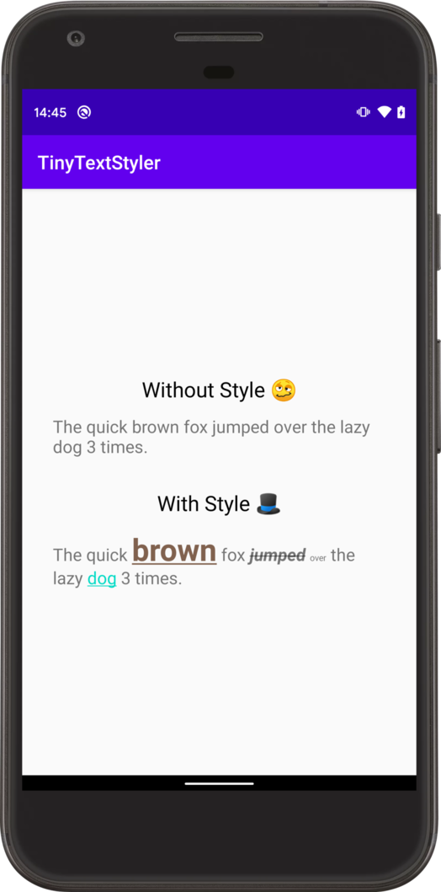

# Tiny Text Styler [  ](https://bintray.com/veritas1/Android/tiny-text-styler/_latestVersion) [](/LICENSE)


The code for applying vanilla string resources:
```
withoutStyleTextView.text = getString(R.string.demo)
```
quickly becomes unwieldy when using string resources with annotations.

Tiny Text Styler is a kotlin android convenience lib that provides some syntactic sugar when setting annotated string resources to your text view:

```
withStyleTextView.text = getStyledText(R.string.demo, textStyler)
```

## Gradle
`implementation 'dev.markcharles:tiny-text-styler:0.1.0'`

# Usage

`getStyledText()` requires a `TinyTextStyler` implementation. `DefaultTextStyler` has been provided as an out the box `TinyTextStyler` implementation and is extendable.

## Convert string resources using annotations
#### Before
```
<string name="demo">The quick brown fox jumped over the lazy dog %1$d %2$s.</string>
```

#### After
```
<string name="demo">The quick <annotation color="#80614e" style="bold|underline" abs_size="32">brown</annotation> fox <annotation style="strike|bold_italic">jumped</annotation> <annotation rel_size="0.5">over</annotation> the lazy <annotation click="dog">dog</annotation> <annotation arg="%1$d">%1$d</annotation> <annotation arg="%2$s">%2$s</annotation>.</string>
```


